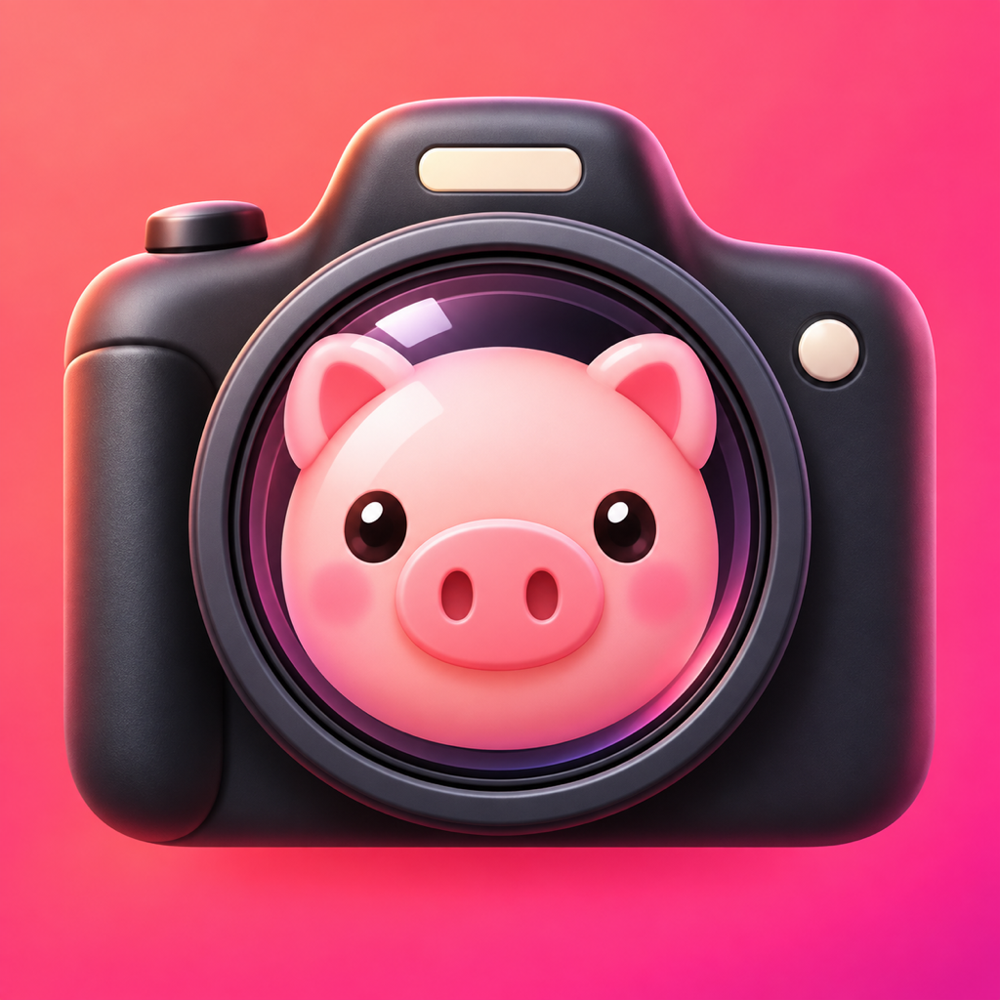

# PiggyCam 🐷📷

PiggyCam 是一款完全在 iPhone 上運作的趣味相機 App。當相機辨識到人臉時，會即時套上可愛的小豬面具；拍攝的照片與影片也會保留小豬效果並儲存到系統照片圖庫。



## 主要功能

- 使用 Apple Vision 即時辨識一張或多張人臉
- 將透明小豬面具動態縮放並合成至臉部位置
- 拍照並儲存已套用效果的照片
- 錄製已套用效果的影片，允許麥克風權限時包含聲音
- 切換前置與後置鏡頭
- 提供類似 iPhone 相機的全螢幕 4:3 取景與拍照／錄影控制
- 支援可用鏡頭的 0.5×、1×、2× 快速切換及雙指縮放
- 點按畫面進行對焦與測光，並可手動調整曝光補償
- 支援閃光燈自動／開啟／關閉、3 秒與 10 秒自拍計時器
- 提供九宮格構圖、錄影時間、觸覺回饋、最近拍攝縮圖與系統照片瀏覽器
- 可隨時開啟或關閉小豬效果
- 可在設定中加入排除人臉；相機辨識到指定人物時不會套用小豬效果
- 針對相機、麥克風與照片圖庫提供完整權限處理
- 所有影像辨識與合成都在裝置端進行，不會上傳照片或影片

## 技術架構

| 元件 | 用途 |
| --- | --- |
| SwiftUI | 相機介面、拍照／錄影模式與操作控制 |
| AVFoundation | 相機影格擷取、麥克風音訊與影片編碼 |
| Vision | `VNDetectFaceRectanglesRequest` 即時人臉偵測 |
| Core Image | 將小豬面具合成至每個相機影格 |
| Photos | 將照片與影片寫入系統照片圖庫 |
| AVAssetWriter | 儲存包含小豬效果的 H.264 影片 |

## 系統需求

- Xcode 26 或相容版本
- iOS 17.0 以上
- 支援前／後相機的 iPhone
- Apple ID（免費 Personal Team 即可安裝至自己的 iPhone）

## 安裝到個人 iPhone

1. Clone 專案並使用 Xcode 開啟 `PiggyCam.xcodeproj`。
2. 使用 USB 連接 iPhone，保持手機解鎖，並在手機上選擇「信任這部電腦」。
3. 在 iPhone 開啟 **設定 → 隱私權與安全性 → 開發者模式**，依提示重新啟動並確認開啟。
4. 在 Xcode 選擇 **PiggyCam Target → Signing & Capabilities**。
5. 保持 **Automatically manage signing** 開啟，並選擇你的 Apple ID Team。
6. 在 Xcode 上方的 Run Destination 選擇你的 iPhone，按 **Run**（⌘R）。
7. 第一次使用個人憑證時，在 iPhone 開啟 **設定 → 一般 → VPN 與裝置管理 → 開發者 App**，信任你的 Apple Development 憑證。
8. 再次按 **Run**，並在 App 首次啟動時允許相機、麥克風及加入照片圖庫。

> 使用免費 Personal Team 簽署的 App 可能需要定期由 Xcode 重新簽署與安裝。

## 使用方式

1. 將鏡頭對準一張或多張人臉，小豬面具會自動出現。
2. 使用上方工具列設定閃光燈、自拍計時器、曝光、格線或小豬效果。
3. 點按取景畫面設定對焦點；使用雙指手勢，或 0.5×／1×／2× 按鈕調整縮放。
4. 選擇「拍照」或「錄影」模式，再按中央快門拍照或開始／停止錄影。
5. 按右下角按鈕切換前置與後置鏡頭。
6. 左下角會顯示照片圖庫中最近的照片或影片縮圖；點按縮圖即可開啟 iOS 系統照片瀏覽器。
7. 點按上方齒輪進入設定，可加入、移除或停用排除人臉。App 會依參考照片自動校準比對容許度，也可切換為手動調整。

> 0.5× 與其他光學鏡頭選項會依 iPhone 的實際相機硬體顯示。Apple 相機的 Live Photo、電影級模式與部分計算攝影屬於系統專屬功能，不在此專案的支援範圍內。

## 專案結構

```text
PiggyCam/
├── PiggyCam.xcodeproj
├── PiggyCam/
│   ├── PiggyCamApp.swift
│   ├── ContentView.swift
│   ├── CameraManager.swift
│   ├── CameraSettingsView.swift
│   ├── FaceExclusionStore.swift
│   └── Assets.xcassets/
│       ├── AppIcon.appiconset/
│       └── PigMask.imageset/
└── README.md
```

## 權限與隱私

PiggyCam 需要以下權限：

- **相機**：擷取影像並辨識人臉。
- **麥克風**：錄製有聲影片；拒絕後仍可使用拍照與無聲錄影。
- **照片（完整或有限取用）**：儲存拍攝結果、顯示最近項目的縮圖，並開啟 iOS 系統照片瀏覽器。選擇有限取用時，只會讀取你允許的項目。

人臉偵測使用 Apple Vision 在本機執行。專案不包含伺服器、分析 SDK 或影像上傳功能。

排除人臉功能會將使用者選擇的參考照片縮小後存放在 PiggyCam 的 App 沙盒，並使用 Apple Vision 在裝置端建立及比對標準化與鏡像人臉特徵。參考照片與特徵不會離開裝置；移除 App 也會一併刪除這些資料。此功能屬於相似度比對，可能受角度、遮擋與光線影響，不應用於身分驗證或安全用途。

## 建置驗證

可使用 Xcode，或執行以下指令進行不簽署的實機 SDK 建置：

```bash
DEVELOPER_DIR=/Applications/Xcode.app/Contents/Developer \
  xcodebuild \
  -project PiggyCam.xcodeproj \
  -scheme PiggyCam \
  -sdk iphoneos \
  -destination 'generic/platform=iOS' \
  CODE_SIGNING_ALLOWED=NO \
  build
```

## 授權

目前尚未指定開源授權。若要公開再利用或發佈，請先加入合適的 `LICENSE`。
